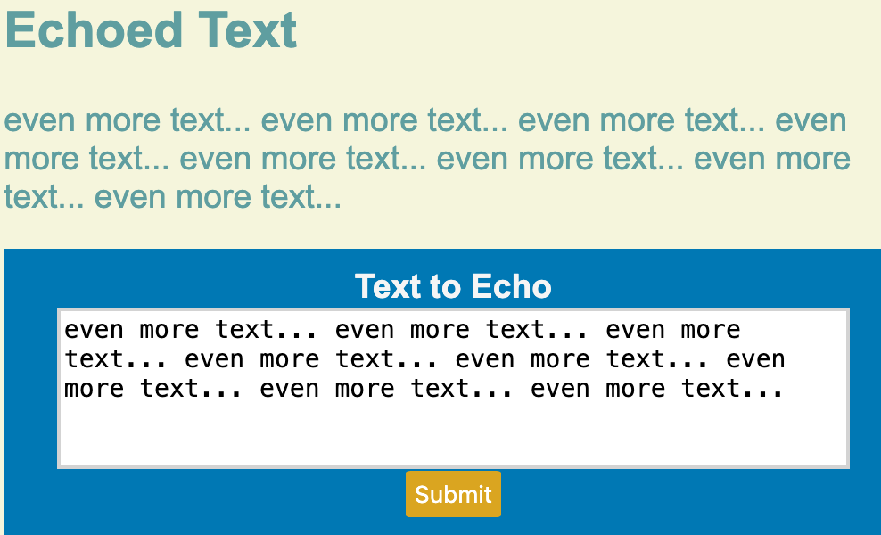

# README

## Brief
My redux of a toy C++ HTTP/1.x server, but it focuses on event-driven handling: It will use socket polling & `std::async` for 'non-blocking' I/O operations.

## References
 - [Beej Sockets Chapter 5](https://beej.us/guide/bgnet/html/split/system-calls-or-bust.html)
    - Important BSD socket API notes
 - [HTTP Made Really Easy](https://jmarshall.com/easy/http/#structure)
    - Crash course of HTTP/1.x basics

## Basic Demonstration

## Roadmap
 - Test GET query param handling.
 - Handle "absolute host" URIs.
 - Finish chunked encoding parsing & sending.
   - After all chunks are sent, put `'0' CRLF`.
 - Add `HEAD` request to reply support.
 - Improve logging: can be disabled and colorized.
